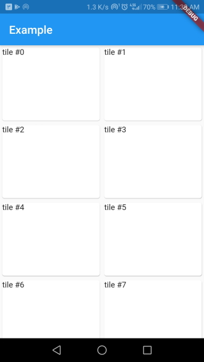

# smart_grid_view

A responsive grid view that changes it's cross axis child count based on the available horizontal size.

This widget is great for creating responsive designs as the sized of tiles stays about the same across different screen sizes.

### How does it work

Using the width of tiles, `SmartGridview` will calculate the `crossAxisCount` for the underlying `GridView` with `maxWidth ~/ tileWidth`.

The `tileHeight` is used with `tileWidth` to calculate `gridChildRatio`.  

# Example

```dart
class MyApp extends StatelessWidget {

  @override
  Widget build(BuildContext context) {
    return MaterialApp(
      home: Scaffold(
        appBar: AppBar(title: Text('Example')),
        body: SmartGridView(
          tileWidth: 128,
          tileHeight: 168,
          children: List.generate(80, (index) => Card(
            child: GridTile(
              child: Text('tile #$index'),
            ),
          )),
        ),
      ),
    );
  }
}
```

##### Result


